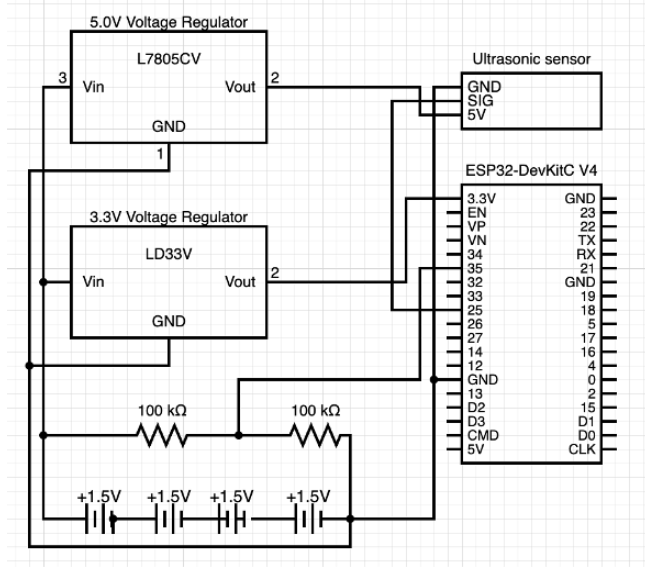

# Wireless Sensor Network for Garbage Monitoring

## About The Project
This project is a low-cost wireless sensor network designed to monitor garbage bin fill levels in real-time. Traditional waste collection often relies on fixed schedules, leading to inefficiencies such as overflowing bins in high-traffic areas or unnecessary pickups in empty ones.   

This system solves that problem by providing live visibility into bin levels, allowing collection efforts to be driven by actual demand. It utilizes a decentralized network of battery-powered nodes that communicate peer-to-peer to aggregate data before uploading it to a central dashboard.

## ⚙️ How It Works
The system architecture combines power-efficient mesh networking with a centralized web dashboard.

### 1. The Hardware Nodes
 Each node consists of an **ESP32 microcontroller** and an **ultrasonic distance sensor** deployed on a garbage bin.
*  **Sensing:** The node measures the empty space (distance) in the bin to calculate the fill level.
*  **Power:** Nodes are battery-powered and utilize deep sleep cycles to extend operational life.

### 2. The Network (Mesh & Election)
 Instead of every node connecting to WiFi (which consumes high power), the system uses **ESP-NOW** for local communication.
*  **Dynamic Election:** Nodes automatically elect a "Head" node based on signal strength (RSSI) and battery voltage.
*  **Data Aggregation:** "Worker" nodes send their sensor data to the elected Head via ESP-NOW.
*  **Cloud Upload:** Only the Head node wakes its WiFi radio to upload the batch data to the backend server via HTTP POST.

### 3. The Web Dashboard
The data is visualized on a React-based frontend, allowing users to:
* View current fill levels and battery status for all nodes.
* See the network topology (which node is currently the "Head").
* Rename nodes for easier identification.

## 🛠️ Tech Stack
* **Firmware:** C++ (Arduino Framework) with ESP-NOW and WiFi libraries.
*  **Backend:** Python Flask.
*  **Frontend:** React + Vite.
*  **Hardware:** ESP32 DevKitC v4, Ultrasonic Sensors, Battery Packs.

---

## 🚀 Getting Started

### Prerequisites
* Python 3.8+
* Node.js & npm
* Arduino IDE (or PlatformIO)

### 1. Backend Setup (Flask)
The backend handles data ingestion and serves the API.

1. Navigate to the backend directory.
2. Install dependencies:
   pip install -r requirements.txt
3. Start the server
    python main.py
### 2. Frontend Setup (React + Vite)
1. Navigate to frontend directory.
    cd /frontend
2. Install dependancies.
    npm install
3. Run the development servers.
    npm run dev
### 3. Hardware/Firmware Setups
1. Setup up each esp32 according to the following diagram: 

    

2. Open ESP32.cpp in the arduino ide (if your ardunio enviroment is not setup for the ESP32 you are using do that now).
3. Your ESP32 and your overall enviroment may be different so edit the gobal varables in ESP32.cpp accordingly. 
3. Upload the program to each ESP32

